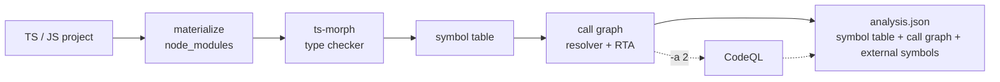

import { Card, CardGrid, LinkCard, Tabs, TabItem } from "@astrojs/starlight/components";

```bash frame="none"
git clone https://github.com/codellm-devkit/codeanalyzer-ts && cd codeanalyzer-ts && bun install && bun run build
```

Point `codeanalyzer-typescript` at a project and it emits a single **`analysis.json`** — a typed model of every module, class, interface, enum, function, and call edge, plus phantom stubs for the library calls that leave the project. One artifact, schema-stable, ready to load into a graph or hand to a code LLM. It's the TypeScript backend behind [CLDK](https://github.com/codellm-devkit/python-sdk), mirroring its [Python](https://github.com/codellm-devkit/codeanalyzer-python) and [Java](https://github.com/codellm-devkit/codeanalyzer-java) siblings, usable standalone as a CLI.

```bash frame="none"
codeanalyzer-typescript --input ./my-ts-project --output ./out
# -> ./out/analysis.json   (symbol table + call graph + external symbols)
```

## What codeanalyzer-typescript gives you

<ul class="cldk-capabilities">
  <a class="cldk-capability" href="/codeanalyzer-ts/guides/concepts/#symbol-table">
    <p class="cldk-capability__title">Symbol table</p>
    <p class="cldk-capability__def">Every module, class, interface, enum, type alias, and callable — typed, located, and queryable.</p>
    <pre class="cldk-capability__thumb">analysis.symbol_table
TSModule -> TSClass -> TSCallable</pre>
    <ul class="cldk-capability__examples"><li>Enumerate classes and methods</li><li>Pull a callable's source body</li></ul>
  </a>
  <a class="cldk-capability" href="/codeanalyzer-ts/guides/concepts/#call-graph">
    <p class="cldk-capability__title">Call graph</p>
    <p class="cldk-capability__def">Who-calls-whom as identity-keyed edges with provenance, resolved by the TypeScript checker.</p>
    <pre class="cldk-capability__thumb">analysis.call_graph
TSCallEdge(source -> target)</pre>
    <ul class="cldk-capability__examples"><li>Find every caller of a method</li><li>Load into a graph and walk it</li></ul>
  </a>
  <a class="cldk-capability" href="/codeanalyzer-ts/guides/call-graph/#rta">
    <p class="cldk-capability__title">RTA dispatch</p>
    <p class="cldk-capability__def">Rapid Type Analysis expands virtual calls to every instantiated subtype's override.</p>
    <pre class="cldk-capability__thumb">edge.tags["ts.dispatch"]
== "rta"</pre>
    <ul class="cldk-capability__examples"><li>Resolve interface/base-type calls</li><li>Tell exact edges from expanded ones</li></ul>
  </a>
  <a class="cldk-capability" href="/codeanalyzer-ts/guides/call-graph/#phantom-nodes">
    <p class="cldk-capability__title">External symbols</p>
    <p class="cldk-capability__def">WALA-style phantom stubs keep edges into imported libraries instead of dropping them.</p>
    <pre class="cldk-capability__thumb">analysis.external_symbols
"node:fs.readFileSync"</pre>
    <ul class="cldk-capability__examples"><li>See calls into <code>express</code> / <code>node:fs</code></li><li>Keep cross-boundary structure</li></ul>
  </a>
  <a class="cldk-capability" href="/codeanalyzer-ts/guides/level-2/">
    <p class="cldk-capability__title">Level 2 (experimental)</p>
    <p class="cldk-capability__def">Opt-in CodeQL enrichment and framework entrypoint detection — the roadmap layer.</p>
    <pre class="cldk-capability__thumb">codeanalyzer-typescript
  -i ./proj -a 2</pre>
    <ul class="cldk-capability__examples"><li>Recover dynamic-dispatch edges</li><li>Surface framework roots</li></ul>
  </a>
</ul>

<div class="cldk-agent-band">

## One artifact, one compiler

There's no second toolchain to install. The same **TypeScript compiler** that type-checks the project — driven through [ts-morph](https://ts-morph.com/) — resolves the symbol table and the call graph. Every call site is mapped to a real declaration by the checker, then **Rapid Type Analysis (RTA)** expands virtual dispatch to the concrete subtypes actually instantiated in the program. Calls that leave the project become **phantom external symbols** rather than dangling edges. Every edge records its `provenance`, so you always know how it was resolved. CodeQL is an opt-in **level 2** layer for the dynamic cases the checker can't reach.

```bash
# Level 1 (default) — tsc resolver + RTA + phantom external nodes
codeanalyzer-typescript --input ./proj

# Level 2 — add CodeQL enrichment (experimental)
codeanalyzer-typescript --input ./proj --analysis-level 2
```



[See how the call graph is built →](/codeanalyzer-ts/guides/call-graph/)

</div>

## Start building

<CardGrid>
  <LinkCard title="Quickstart" description="Build the CLI and produce your first analysis.json in a couple of minutes." href="/codeanalyzer-ts/quickstart/" />
  <LinkCard title="What is codeanalyzer-typescript?" description="The mental model: project in → one typed TSApplication artifact out." href="/codeanalyzer-ts/what-is-codeanalyzer/" />
  <LinkCard title="CLI usage" description="Every flag, with worked examples: output formats, caching, incremental mode, build control." href="/codeanalyzer-ts/guides/cli-usage/" />
  <LinkCard title="Call graph & dispatch" description="How the checker resolves edges, what RTA expands, and how phantom nodes work." href="/codeanalyzer-ts/guides/call-graph/" />
</CardGrid>

## Learn more

<CardGrid>
  <LinkCard title="Core concepts" description="Symbol table, call graph, external symbols, signatures, provenance, and the analysis cache." href="/codeanalyzer-ts/guides/concepts/" />
  <LinkCard title="Output schema" description="The TSApplication data model, field by field." href="/codeanalyzer-ts/reference/schema/" />
  <LinkCard title="Level 2: CodeQL & entrypoints" description="What --analysis-level 2 will add, and where it stands today." href="/codeanalyzer-ts/guides/level-2/" />
  <LinkCard title="CLI options" description="The complete flag table with defaults." href="/codeanalyzer-ts/reference/cli/" />
</CardGrid>

<p class="cldk-badges">
  <a href="https://github.com/codellm-devkit/codeanalyzer-ts"></a>
  <a href="https://opensource.org/licenses/Apache-2.0"></a>
  <a href="https://discord.gg/zEjz9YrmqN"></a>
</p>
